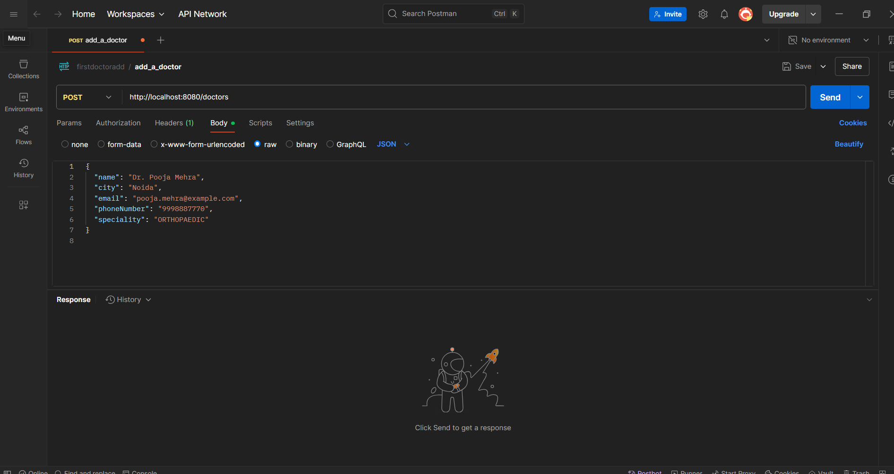
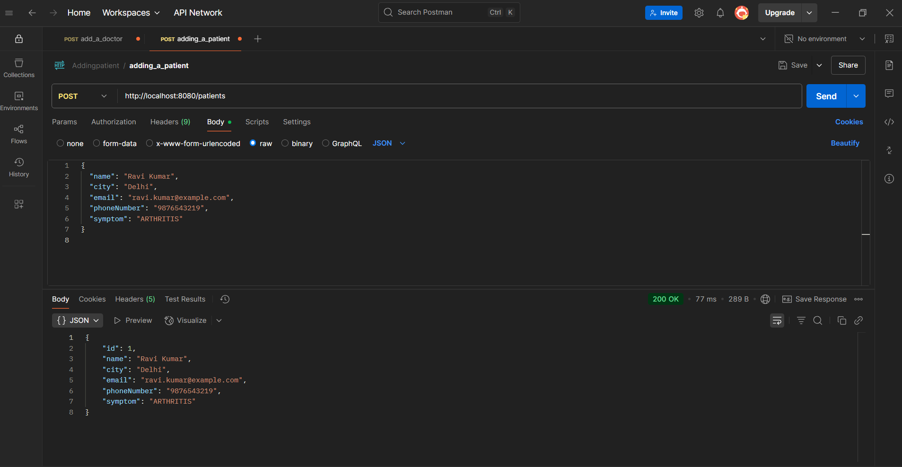
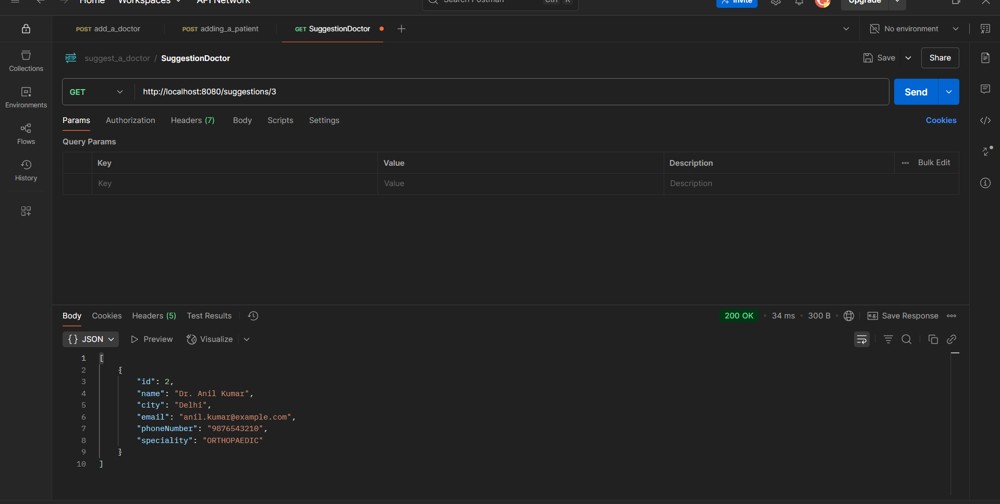

# 🏥 Doctor-Patient REST API

Spring Boot project for managing doctors, patients, and suggesting doctors based on patient symptoms.  
Assignment submitted for **Xcelore Java Technical Round**.

---

## 🚀 Tech Stack

- Java 21
- Spring Boot 3.4.5
- Spring Data JPA
- H2 In-Memory Database
- Maven
- Postman

---

## ⚙️ How to Run

bash
./mvnw spring-boot:run
H2 console: http://localhost:8080/h2-console
JDBC URL: jdbc:h2:mem:xceloredb

📮 API Endpoints
➕ Add Doctor
POST /doctors

{
  "name": "Dr. Anil Kumar",
  "city": "Delhi",
  "email": "anil@example.com",
  "phoneNumber": "9876543210",
  "speciality": "ORTHOPAEDIC"
}
➕ Add Patient
POST /patients


{
  "name": "Ravi Kumar",
  "city": "Delhi",
  "email": "ravi@example.com",
  "phoneNumber": "9990000001",
  "symptom": "ARTHRITIS"
}
💡 Suggest Doctor
GET /suggestions/{patientId}
Returns matching doctor or fallback message.

📦 Postman Collection
➡️ /postman/doctor-patient-collection.json


📸 API Testing Screenshots
### ➕ Add Doctor


### ➕ Add Patient


### 💡 Suggest Doctor



🧑‍💻 Author
Tanuj Bhandari
GitHub: @Tanuj-bhandari

✅ Final Checklist
 Code pushed to GitHub

 Postman collection added

 Screenshots uploaded

 README complete


## ✅ Next Steps

Now just run:

```bash
git add README.md
git commit -m "Update README with screenshot links"
git push origin main
